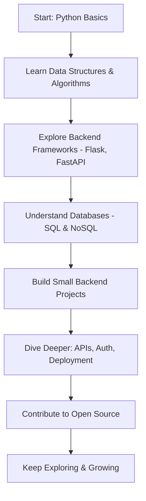

# demo
<!--
  Hi there! Thanks for visiting my profile.
  Minimalist • Professional • Dark Aesthetic
-->

<h1 align="center">Hey👋, I'm 0xroot-suraj</h1>
<p align="center">
  <em>Developer • Student • Backend Enthusiast</em>
</p>

---

## 🧠 About Me

```bash
> echo "Hello, World!"
~ 'Im a 19-year-old coder from India, passionate about Computer Science.'
~ 'Currently diving deep into Python, backend development, and automation.'
~ 'I believe in staying consistent, learning daily, and building cool things.'
```

---

## 💻 My Toolbox

```bash
> tech stack --list
[✔] Python     [✔] Flask       [✔] FastAPI
[✔] Git        [✔] MySQL       [✔] SQLite
[✔] HTML/CSS   [✔] GitHub      [✔] VS Code
```

---

## 📊 GitHub Stats

<p align="center">
  
  <br/>
  
</p>

---

## 🧭 Goals (2025)

- ✅ Publish my first GitHub repository
- 🎯 Balance competitive exam prep with development practice
- 🧠 Stay consistent with self-learning and documentation
- 📖 Strengthen DSA & problem-solving skills
- 🚧 Make a full-stack web app (40%)
- 🚀 Contribute to Open Source

---

## 🛤️ Learning Roadmap


---

## 🔖 Quote I Live By

```bash
> "First, solve the problem. Then, write the code."
        – John Johnson
```

---

<details>
  <summary>📂 More About Me</summary>

- 🧠 Aspiring Computer Science student  
- 🐍 Obsessed with Python and backend logic  
- 🖤 Loves minimalism, aesthetics, and well-documented code  
- 🧩 Enjoys building side projects and automating things  
- ✉️ Always curious, always learning  
</details>

---

<h2>📫 Connect with me</h2>

<p style="font-size: 16px;">
  <a href="https://www.linkedin.com/in/shakti-suraj/" target="_blank"><strong>LinkedIn</strong></a>
  &nbsp;•&nbsp;
  <a href="https://x.com/0xroot_suraj" target="_blank"><strong>X (formerly Twitter)</strong></a>
  &nbsp;•&nbsp;
  <a href="mailto:your.shaktisuraj35@gmail.com"><strong>Email</strong></a>
</p>

---

<p align="center">
  <i>~ Code. Learn. Repeat. ~</i>
</p>This is my first Git repository. 
<br>
Author - Omm Saswat Parida
